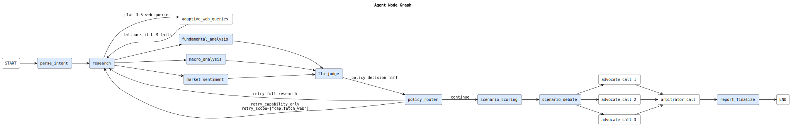

# Agentic Invest

## Project Intro

Agentic Invest is a multi-agent investment research system that turns open-ended market questions into structured, evidence-backed reports.

Given a query, the system plans the research scope, gathers finance/macro/web evidence, runs parallel analysis nodes, evaluates whether additional evidence is needed, calibrates forward scenarios, and produces a validated report in Markdown and JSON formats.

The goal is to reduce noise from scattered metrics and headlines, and provide a clearer decision view: what the fundamentals say, what market sentiment implies, which scenarios are plausible, and what to watch next.



## Quick Start

```bash
python3 -m venv .venv
source .venv/bin/activate
pip install -r requirements.txt
cp .env.example .env
PYTHONPATH=. uvicorn src.server.main:app --reload
```

Server starts on `http://localhost:8000`.

## Environment Variables

Environment configuration is defined in [`.env.example`](.env.example).

## Code Quality

```bash
ruff format .
ruff check . --fix
ruff check .
```

## Structure

- `src/server/`: FastAPI backend, orchestration graph, capability layer, services, models, and utilities.
- `src/frontend/`: static frontend used for local interactive runs.
- `design/`: architecture, callpoint, frontend, and test documentation.
- `tests/`: unit and integration tests.
- `outputs/`: generated artifacts (including local cache/report outputs).


## Key Design Considerations

### Accuracy

- The system prevents error propagation by gating progress through `llm_judge` and `policy_router`.
- The system uses fine-grained retry control to trigger targeted capability retries instead of full research re-runs.
- `scenario_debate` challenges baseline scenario probabilities before final reporting.

### Modularity

- The runtime follows a clear layering: `routes -> agents -> capabilities -> services -> utils/models`.
- A centralized agent registry is the source of truth for node contracts and dependencies.

### Robustness

- State contract enforcement via `registry.py` + `contract.py` constrains per-node read/write fields and reduces hidden state coupling and regression risk.
- The system uses best-effort degradation for non-critical LLM failures.
- The system fails fast only on hard preconditions.

### Testability

- Node logic is testable in isolation because contracts are explicit and dependencies are injectable/mocked.
- Policy behavior is testable with deterministic rule-engine unit tests (`policy.py`) independent of LLM variance.


### Observability

- Stream live execution events to the UI (`agent_status`, `llm_call`, `section_ready`, `final`, `error`, `done`).
- The status model uses `lifecycle` (`standby/active/waiting/blocked/degraded/failed`) plus `phase` (task stage such as `collecting_evidence` or `generating_report`).


## Design Docs

- [`design/codebase.md`](design/codebase.md): repository layout and runtime layering.
- [`design/core-system.md`](design/core-system.md): end-to-end graph topology, state contract, and node responsibilities.
- [`design/llm-callpoints.md`](design/llm-callpoints.md): active LLM callsites, expected formats, and failure behavior.
- [`design/frontend.md`](design/frontend.md): frontend interaction model and streaming UX.
- [`design/test-suite.md`](design/test-suite.md): test strategy and coverage map.